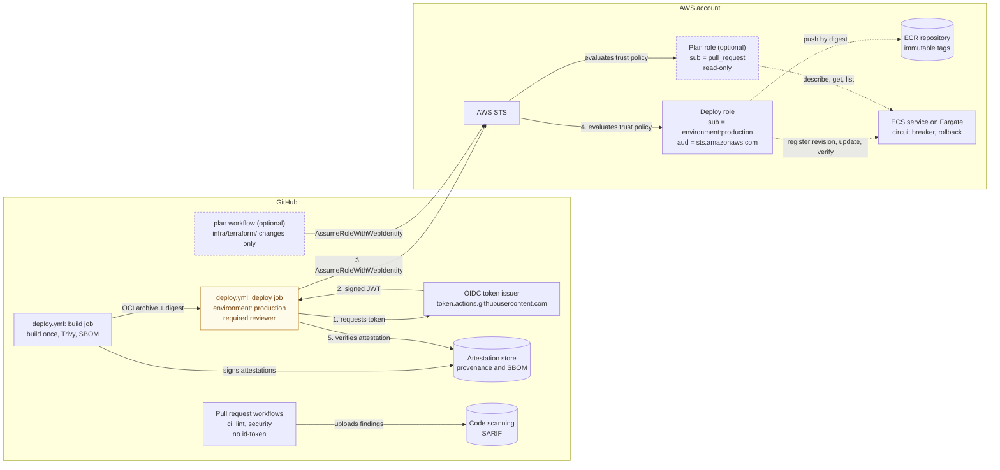

# GitHub Actions to AWS with OIDC, a least-privilege role and security gates

[](https://github.com/gamaware/github-actions-aws-oidc-lab/actions/workflows/ci.yml)
[](https://github.com/gamaware/github-actions-aws-oidc-lab/actions/workflows/lint.yml)
[](https://github.com/gamaware/github-actions-aws-oidc-lab/actions/workflows/security.yml)
[](https://securityscorecards.dev/viewer/?uri=github.com/gamaware/github-actions-aws-oidc-lab)
[](LICENSE)

> **Personal lab / demonstration. Not client code.**

AWS access keys stored as CI secrets live for a long time and rarely get rotated. This lab deploys a small container
service to Amazon ECS on Fargate from GitHub Actions with **no stored AWS keys**. The deploy job exchanges a
short-lived GitHub OIDC token for temporary credentials on an IAM role that trusts only this repository's
`production` environment. That role can push to one ECR repository and update one ECS service, nothing else. The
image is built once, scanned, attested and deployed by digest, and the rollout is verified before the run passes.

**Decisions:** [docs/adr/](docs/adr/README.md) · **Threat notes:** [docs/threat-notes.md](docs/threat-notes.md) ·
**Changes:** [CHANGELOG.md](CHANGELOG.md)

## What this proves

| Claim | Evidence in this repository |
| --- | --- |
| No long-lived AWS credentials anywhere | No AWS secrets; the deploy job uses `id-token: write` and `configure-aws-credentials` with a role ARN variable |
| The role trusts exactly one subject and one audience | `infra/terraform/policies/trust-policy.json.tftpl`; asserted by `infra/terraform/tests/iam.tftest.hcl` ([ADR 0001](docs/adr/0001-exact-subject-matching.md), [ADR 0002](docs/adr/0002-environment-subject-only.md)) |
| The role can touch one repository and one service | `infra/terraform/policies/deploy-policy.json.tftpl`; no wildcard actions, Resource `*` only in three named statements, PassRole only for the execution role, all asserted in tests ([ADR 0004](docs/adr/0004-one-role-per-deploy-target.md)) |
| Pull requests cannot deploy | `ci.yml`, `lint.yml` and `security.yml` have no `id-token: write`; the deploy role refuses the `pull_request` subject |
| What ships is what was scanned | `deploy.yml` builds once, gates with Trivy, attests provenance and an SBOM, pushes with the digest preserved, deploys `image@sha256` ([ADR 0005](docs/adr/0005-build-once-deploy-by-digest.md)) |
| A rollback cannot pass as success | `scripts/verify-deployment.sh` checks the PRIMARY revision, rollout state, task health and image digest |
| Code, image and infrastructure are gated | Semgrep, Trivy and Checkov as required checks with SARIF in code scanning ([ADR 0006](docs/adr/0006-security-gates.md)) |
| The workflows themselves are hardened | `permissions: {}` at the top, per-job grants, SHA-pinned actions, no `pull_request_target`, `actionlint` and `zizmor` in CI, OpenSSF Scorecard |

## Architecture



| Key | Meaning |
| --- | --- |
| Solid arrow | A call or hand-off made by the job at the tail, labelled with what it sends |
| Dotted arrow | What a role's permission policy allows once assumed |
| Cylinder | A store: registry, attestations or scan results |
| Yellow box | A job that waits for the required reviewer |
| Dashed border | Optional; exists only with `create_plan_role = true` |

### Token flow, step by step

1. A push to `main` starts `deploy.yml`. The `build` job builds the image once into an OCI archive, fails on fixable
   HIGH or CRITICAL findings, and signs a build-provenance attestation and an SBOM attestation for the manifest
   digest. It has `id-token: write` only for signing; the deploy role refuses its `ref` subject.
2. The `deploy` job declares `environment: production`, so it waits for the required reviewer. It then asks
   GitHub's OIDC issuer for a JWT with `aud: sts.amazonaws.com` and `sub: repo:OWNER/REPO:environment:production`.
3. `aws-actions/configure-aws-credentials` calls `sts:AssumeRoleWithWebIdentity` with that token and the role ARN
   from the `AWS_ROLE_ARN` repository variable. The ARN is not a secret.
4. STS validates the signature against the OIDC provider in the account and evaluates the trust policy. Any other
   audience or subject is denied. The credentials expire in one hour.
5. The job pushes the archive with `skopeo copy --preserve-digests`, checks that the registry digest matches the
   built one, and verifies the attestation. It deploys a task definition revision with `image@sha256:<digest>`,
   waits for a stable service, then runs `scripts/verify-deployment.sh` so a circuit-breaker rollback fails the run.

## Repository layout

```text
app/                    tiny HTTP service (Python standard library), Dockerfile, unit tests
infra/terraform/                  Terraform: OIDC provider, deploy role, optional plan role, ECR, ECS cluster and service
infra/terraform/policies/         trust and permission policies as JSON templates, readable on their own
infra/terraform/tests/            terraform test with a mocked AWS provider: trust, permissions, validations
infra/terraform/backend.*.example S3 backend with a native lock file
scripts/                verify-deployment.sh, used by deploy.yml and runnable from a laptop
.github/workflows/      ci (tests, hadolint, shellcheck), lint (actionlint, zizmor, terraform, tflint),
                        security (Semgrep, Trivy, Checkov), plan (optional read-only plan),
                        deploy (build once, deploy by digest, verify), scorecard (OpenSSF)
docs/adr/               architecture decision records
docs/threat-notes.md    what the trust conditions block, case by case
```

## How to run it

Prerequisites: Terraform 1.9 or later (CI pins the version in `infra/terraform/.terraform-version`), AWS
credentials for a sandbox account with IAM admin rights (only for this one-time setup), a VPC with subnets that can reach ECR, and a
copy of this repository under your own account.

1. **Create the infrastructure once.**

   ```bash
   cd infra/terraform
   cp terraform.tfvars.example terraform.tfvars   # set github_owner, github_repo, vpc_id, subnet_ids
   # Optional remote state: cp backend.tf.example backend.tf; cp backend.hcl.example backend.hcl; edit it
   terraform init              # or: terraform init -backend-config=backend.hcl
   terraform apply
   ```

   If the account already has the GitHub OIDC provider, set `create_oidc_provider = false`.

2. **Create the `production` environment** in the repository settings. Add a required reviewer and limit deployment
   branches to `main`. Both settings are part of the trust model ([ADR 0002](docs/adr/0002-environment-subject-only.md)).

3. **Add repository variables** (Settings, Secrets and variables, Actions, Variables). None of them is a secret:

   | Variable | Value |
   | --- | --- |
   | `AWS_ROLE_ARN` | `terraform output -raw deploy_role_arn` |
   | `AWS_REGION` | the region you used, for example `us-east-1` |
   | `ECR_REPOSITORY_URL` | `terraform output -raw ecr_repository_url` |
   | `ECS_CLUSTER` | `terraform output -raw ecs_cluster` |
   | `ECS_SERVICE` | `terraform output -raw ecs_service` |
   | `ECS_TASK_FAMILY` | `terraform output -raw task_definition_family` |
   | `APP_URL` (optional) | base URL that reaches the service, for the HTTP part of the verification |

4. **Turn on the required checks** listed in [CONTRIBUTING.md](CONTRIBUTING.md) with the `gh api` command there.

5. **Push to `main`.** Approve the deployment, then watch the build, push, deploy and verification steps. The
   service starts with `desired_count = 0`; set it to `1` and apply again once the first image exists.

6. **Optional: read-only plan on pull requests.** Use the S3 backend, set `create_plan_role = true` and
   `state_bucket`, apply, then add the variables `AWS_PLAN_ROLE_ARN` (`terraform output -raw plan_role_arn`),
   `TF_STATE_BUCKET`, and `TF_VARS_JSON` (your `terraform.tfvars` values as one JSON object). Pull requests that
   change `infra/terraform/` then show the plan in the job summary ([ADR 0007](docs/adr/0007-read-only-plan-role.md)).

### Run the checks locally

```bash
uvx --with-requirements app/requirements-dev.txt pytest -q
docker build -t oidc-lab app && trivy image --severity HIGH,CRITICAL --ignore-unfixed --exit-code 1 oidc-lab
(cd infra/terraform && terraform init -backend=false && terraform test)
pre-commit run --all-files
```

[CONTRIBUTING.md](CONTRIBUTING.md) has the full list, including Semgrep, Checkov and tflint. None of them need AWS.

## Checks you can repeat

- **A job without the environment cannot assume the role.** Copy the credentials step into a workflow on `main` or
  any branch with no `environment` and run it. It fails with `Not authorized to perform
  sts:AssumeRoleWithWebIdentity`, because the token's subject is `repo:OWNER/REPO:ref:refs/heads/<branch>`.
- **A pull request cannot deploy.** `ci.yml`, `lint.yml` and `security.yml` have no `id-token: write`. The
  optional `plan.yml` gets a token with the `pull_request` subject, which the deploy role refuses and only the
  read-only plan role accepts. Fork pull requests get no token at all.
- **The deployed image is the attested one.** Take the digest from the deploy job summary and run
  `gh attestation verify oci://YOUR_ECR_REPOSITORY_URL@sha256:DIGEST --repo OWNER/REPO`.
- **The federated session is visible in CloudTrail.** Look up `AssumeRoleWithWebIdentity` events. The event shows
  `userIdentity.type: WebIdentityUser`, the provider `token.actions.githubusercontent.com`, the subject, and the
  session name `gha-<run_id>-<attempt>`, which links it to one workflow run.

  ```bash
  aws cloudtrail lookup-events \
    --lookup-attributes AttributeKey=EventName,AttributeValue=AssumeRoleWithWebIdentity \
    --max-results 5
  ```

## Cost and teardown

The costs are the Fargate task while it runs, ECR storage for at most 10 images (a lifecycle rule expires the rest),
CloudWatch Logs and Container Insights, and one customer managed KMS key for the logs (about 1 USD per month). The
GitHub side is free for public repositories. Scale the service to zero tasks between demos:

```bash
terraform apply -var desired_count=0
```

`terraform destroy` removes everything, including images in the repository (`ecr_force_delete` defaults to `true`).
The KMS key is deleted after its 7-day waiting period. A state bucket created for the backend is not part of this
stack; delete it separately.

## Honest limits

- **Not run against AWS in CI.** The trust and permission policies are tested offline with a mocked provider
  ([ADR 0008](docs/adr/0008-offline-policy-tests.md)). That proves what the JSON says, not how AWS evaluates it; the
  manual checks above cover that.
- **Some controls live in GitHub settings, not in code:** the `production` environment's reviewer and branch
  policy, and branch protection with the required checks. The repository documents them; it cannot enforce them.
- **The permission policy limits where the job deploys, not what.** Anyone who can merge to `main` and approve
  `production` can ship any image that passes the gates.
- **Attestations are verified by the pipeline, not by ECS.** Nothing stops someone with console access from
  registering a task definition with an unverified image.
- **No load balancer.** The service has no public endpoint by default, so post-deploy verification relies on the
  container health check unless you set `APP_URL`.
- **Single environment.** One account, one `production` environment. A real setup would add a staging environment,
  ideally in its own account, with its own role and subject.
- **The optional plan role exposes state to same-repository pull requests.** Fine for this stack, not for one
  whose state holds secrets ([ADR 0007](docs/adr/0007-read-only-plan-role.md)).

## Variants

The same pattern (one OIDC provider, one role per deploy target, a subject pinned to a repository and environment)
works for other targets:

- **AWS Lambda:** replace the ECR and ECS statements with `lambda:UpdateFunctionCode` and
  `lambda:PublishVersion` on one function ARN.
- **S3 static hosting:** allow `s3:PutObject` and `s3:DeleteObject` on one bucket prefix and
  `cloudfront:CreateInvalidation` on one distribution.
- **GitLab CI:** register `https://gitlab.com` as the OIDC provider and match
  `project_path:GROUP/PROJECT:ref_type:branch:ref:main` in the subject condition.

## License

[MIT](LICENSE)
