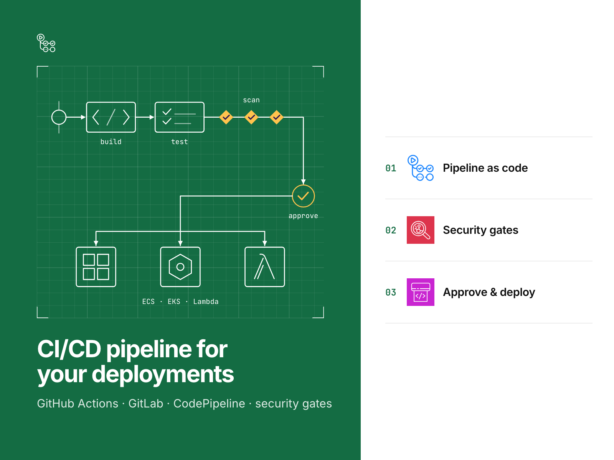
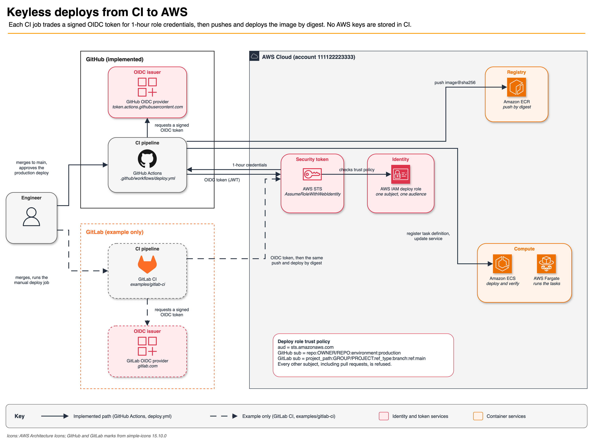
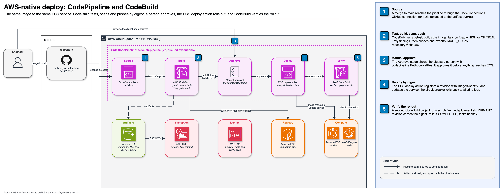

# GitHub Actions to AWS with OIDC, a scoped deploy role and security gates

Deploy a container to Amazon ECS on Fargate from CI with no stored AWS keys, a role that reaches one service, and
gates that stop an unscanned image. GitHub Actions end to end, with the same deploy on GitLab CI and on AWS
CodePipeline with CodeBuild as tested examples.

[](https://github.com/gamaware/github-actions-aws-oidc-lab/actions/workflows/ci.yml)
[](LICENSE)




> **Lab.** Harbor Goods and all data here are fictional. Each repository in this portfolio is a
> separate engagement with Harbor Goods, a fictional mid-size retailer. Account IDs are AWS documentation examples.

## What this proves

- **No long-lived AWS keys in CI.** The deploy job trades a short-lived OIDC token for one-hour role credentials.
  The trust policy accepts one subject and one audience, with `StringEquals` only.
- **A role that reaches one service.** It can push to one ECR repository, update one ECS service and pass one
  execution role, and nothing else. Offline tests assert this, and `make test-live` asks the IAM policy simulator.
- **The deployed image is the scanned image.** It is built once, gated by Trivy, attested, pushed with its digest
  preserved and deployed as `image@sha256`. A post-deploy check fails the run if the circuit breaker rolled back.
- **Pull requests cannot deploy.** The deploy role refuses the `pull_request` subject, and no pull request workflow
  in this repository can request an `id-token`.
- **The same pattern on GitLab CI.** `examples/gitlab-ci/` deploys the same image to the same service through
  GitLab's OIDC tokens, with its own tests. Jenkins is covered as a documented pattern.
- **The same deploy with AWS-native tools.** `examples/codepipeline/` runs CodeBuild (tests, Trivy gate, push by
  digest), a manual approval and the ECS deploy action in CodePipeline, with one scoped role per principal and
  encrypted artifacts that expire. Offline tests assert the stage order and every role's actions.

## Inspect the deliverable

| Artifact | What to look at |
| --- | --- |
| [deploy.yml](.github/workflows/deploy.yml) | Build once, Trivy gate, attestations, OIDC, push by digest, deploy, verify |
| [trust-policy.json.tftpl](infra/terraform/policies/trust-policy.json.tftpl) | The single trusted subject and audience |
| [deploy-policy.json.tftpl](infra/terraform/policies/deploy-policy.json.tftpl) | One repository, one service, one role to pass |
| [iam.tftest.hcl](infra/terraform/tests/iam.tftest.hcl) | Offline assertions on both policies, wildcards refused |
| [verify-deployment.sh](scripts/verify-deployment.sh) | The post-deploy check that catches a circuit-breaker rollback |
| [examples/gitlab-ci](examples/gitlab-ci/README.md) | The GitLab CI pipeline, its role and tests |
| [examples/codepipeline](examples/codepipeline/README.md) | CodePipeline, CodeBuild buildspecs, three roles and tests |
| [codepipeline.tftest.hcl](examples/codepipeline/terraform/tests/codepipeline.tftest.hcl) | Approval before deploy, encryption, no wildcard actions |
| [threat-notes.md](docs/threat-notes.md) | Each token subject and whether STS accepts it |
| [deploy-runbook.md](docs/deploy-runbook.md) | Deploying the lab to a sandbox account, cost and teardown |

## Scenario and acceptance criteria

Harbor Goods, a fictional mid-size retailer, deploys a small storefront service to ECS on Fargate in its production
account (`111122223333`). Today a CI secret
holds an IAM user's access key with broad permissions, and a pull request from any branch can run a job that uses
it. The team uses GitHub for the storefront and GitLab for two internal tools, and wants one pattern for both.

The work is done when:

1. No workflow or pipeline stores an AWS access key; `tests/test_gitlab_example.py` and a repository search find none.
2. The deploy role trusts exactly `repo:OWNER/REPO:environment:production` (GitHub) or the protected `main` branch
   subject (GitLab), with audience `sts.amazonaws.com`; `terraform test` asserts both.
3. The role's actions are named in full and scoped to one repository, service and execution role; `terraform test`
   asserts it offline and `make test-live` checks it with the IAM policy simulator.
4. A pull request cannot obtain AWS credentials; `tests/test_workflows.py` fails if any pull request workflow in
   `.github/workflows/` asks for an `id-token`.
5. The deployed digest equals the scanned digest, and a rollback fails the run.
6. `make verify` passes offline in under a minute.
7. The same deploy through AWS CodePipeline keeps the same gates: tests and Trivy before the push, a manual approval
   before the ECS deploy, deploy by digest, and roles with every action named; `terraform test` asserts it offline.

## Architecture





The engineer merges to `main` and approves the production deploy. The CI job asks its own OIDC issuer for a signed
token, and AWS STS exchanges it for one-hour credentials after checking the deploy role's trust policy. With those
credentials the job pushes the scanned image to Amazon ECR by digest and updates the Amazon ECS service, then verifies
the rollout. GitHub Actions is the implemented path; GitLab CI (dashed) is the tested example.

The deployment view shows the seven steps of `deploy.yml`, the approval gate and the pull request path that STS
refuses: [docs/diagrams/deploy-flow.png](docs/diagrams/deploy-flow.png). Diagram sources are the `.drawio` files next
to the images.

### AWS-native alternative: CodePipeline and CodeBuild



For clients whose delivery runs inside AWS, `examples/codepipeline/` deploys the same image to the same service with
AWS CodePipeline. The source is a GitHub repository through AWS CodeConnections (or a zip in the artifact bucket).
A CodeBuild project runs the tests, builds the image, stops on fixable HIGH or CRITICAL Trivy findings and pushes it,
then exports the image as `repository@sha256:<digest>`. A manual approval shows that digest, the ECS deploy action
rolls it out, and a second CodeBuild project runs the same `verify-deployment.sh`. The pipeline, build and verify
roles are separate: only the pipeline can deploy, only the build can push. Artifacts and build logs are encrypted
with a pipeline KMS key, and the artifact bucket expires them after 30 days. When to choose each tool is in
[ADR 0010](docs/adr/0010-github-actions-vs-codepipeline.md); setup is in
[examples/codepipeline/README.md](examples/codepipeline/README.md).

## Verify locally

Prerequisites, with the versions CI uses: Python 3.13 with [uv](https://docs.astral.sh/uv/), Terraform 1.14.5 (from
`infra/terraform/.terraform-version`; 1.11 or later works), tflint 0.61.0, shellharden 4.3.2, hadolint 2.15.1, and
shellcheck (CI uses the runner's; 0.11.0 locally). No AWS account or credentials.

```bash
make verify
```

Expected output ends with:

```text
Success! 7 passed, 0 failed.
Success! 7 passed, 0 failed.
Success! 7 passed, 0 failed.
Success! 3 passed, 0 failed.
...
No findings to report. Good job! (7 suppressed)
verify: all checks passed
```

It takes about 30 seconds once tools and providers are cached. It runs pytest (66 tests), ruff, `terraform fmt`,
`validate`, mocked `terraform test` and tflint on the four Terraform roots (the fourth is the live-test network),
Checkov, shellcheck, shellharden, hadolint, actionlint and zizmor. `make image` adds the Trivy image gate (needs
Docker) and `make semgrep` the Semgrep rulesets.

`make test-live` is optional and manual. It applies the GitHub and GitLab Terraform roots to a sandbox account, checks
the roles with the IAM policy simulator and always destroys what it created; see
[deploy-runbook.md](docs/deploy-runbook.md#automated-live-check). `make test-live-codepipeline` does the same for the
CodePipeline path and also runs the pipeline end to end, approval included. Both run private-only: a dedicated VPC
with no internet path, no public IPs, and a pre-flight that refuses any plan with an internet-facing resource before
it is applied ([docs/live-test.md](docs/live-test.md)). To deploy the lab end to end from your own fork, follow the
same runbook.

## Repository map

```text
app/                       Python standard-library HTTP service, its tests, Dockerfile pinned by digest
infra/terraform/           OIDC provider, deploy role, optional read-only plan role, ECR, ECS on Fargate
infra/terraform/policies/  trust and permission policies as JSON templates
infra/terraform/tests/     terraform test with a mocked provider
examples/gitlab-ci/        .gitlab-ci.yml and a Terraform root for the GitLab OIDC role, with tests
examples/codepipeline/     buildspecs and a Terraform root for CodePipeline, CodeBuild and their roles, with tests
examples/workflows/        plan.yml: a read-only terraform plan on pull requests, for a client to install
tests/                     pytest: workflow hardening rules, GitLab pipeline and buildspec properties, live-test guards
tests/live/                private network root and deploy-target settings for the live tests, with terraform test
scripts/                   verify-deployment.sh (every pipeline), test-live.sh and test-live-codepipeline.sh
                           (manual, real AWS), check_private_plan.py (their pre-flight)
.github/workflows/         ci (make verify + shared checks), security (SARIF gates), deploy, scorecard,
                           update-pre-commit-hooks
docs/adr/                  architecture decision records
docs/diagrams/             context, deployment and CodePipeline diagrams (.drawio source, .png export)
docs/                      threat notes, deploy runbook, live tests, Jenkins pattern
```

## Decisions and trade-offs

Architecture decision records follow the *Fundamentals of Software Architecture* (2nd ed.) format.

| Number | Title | Status |
| --- | --- | --- |
| [0001](docs/adr/0001-exact-subject-matching.md) | Match OIDC claims with StringEquals, never StringLike | Accepted |
| [0002](docs/adr/0002-environment-subject-only.md) | Trust only the environment subject, not the branch subject | Accepted |
| [0003](docs/adr/0003-no-task-role.md) | No ECS task role; the execution role only pulls and logs | Accepted |
| [0004](docs/adr/0004-one-role-per-deploy-target.md) | One OIDC role per deploy target | Accepted |
| [0005](docs/adr/0005-build-once-deploy-by-digest.md) | Build once, scan what ships, deploy by digest, verify after | Accepted |
| [0006](docs/adr/0006-security-gates.md) | Semgrep, Trivy and Checkov as required checks, with SARIF in code scanning | Accepted |
| [0007](docs/adr/0007-read-only-plan-role.md) | A separate, optional, read-only role for terraform plan on pull requests | Accepted |
| [0008](docs/adr/0008-offline-policy-tests.md) | Test IAM policies offline with terraform test and a mocked provider | Accepted |
| [0009](docs/adr/0009-gitlab-ci-example.md) | Show the GitLab CI equivalent as a tested example, bound to the protected branch | Accepted |
| [0010](docs/adr/0010-github-actions-vs-codepipeline.md) | GitHub Actions vs CodePipeline: when to use each | Accepted |
| [0011](docs/adr/0011-plan-workflow-as-example.md) | Ship the pull request plan workflow as a client-installed example | Accepted |
| [0012](docs/adr/0012-live-tests-run-private-only.md) | Live tests run private-only | Accepted |

## Security and quality gates

| Gate | Where | Why |
| --- | --- | --- |
| `make verify` | `ci.yml` (`verify`) | Same command as locally: tests, Terraform tests, linters, Checkov, workflow scanners |
| markdownlint, lychee, Vale | `ci.yml`, shared `lint-docs` | Docs stay readable and links stay alive |
| actionlint, zizmor | `ci.yml`, shared `lint-actions` | Workflow syntax and known-bad patterns |
| gitleaks | `ci.yml`, shared `secrets` | No credentials in history |
| hadolint, image build and Trivy | `ci.yml`, shared `container` | Dockerfile rules and image vulnerabilities |
| Trivy on the repository | `ci.yml`, shared `security` | Vulnerabilities, secrets and IaC misconfigurations |
| Semgrep, Trivy image, Checkov | `security.yml` | Required gates with SARIF in code scanning ([ADR 0006](docs/adr/0006-security-gates.md)) |
| OpenSSF Scorecard | `scorecard.yml` | The repository's own supply-chain practices |

Every workflow starts from `permissions: {}` and grants per job; actions and the shared reusable workflows are pinned
to full commit SHAs, and there is no `pull_request_target`. Pre-commit runs the same hygiene locally, plus
detect-secrets and conventional commit messages.

Branch protection on `main` requires these checks; the command that applies them is in the
[deploy runbook](docs/deploy-runbook.md#repository-settings):

| Check | Workflow |
| --- | --- |
| `verify` | `ci.yml` (`make verify`) |
| `lint-docs / markdownlint`, `lint-docs / links`, `lint-docs / vale` | `ci.yml` (shared `lint-docs`) |
| `lint-actions / actionlint`, `lint-actions / zizmor` | `ci.yml` (shared `lint-actions`) |
| `secrets / gitleaks` | `ci.yml` (shared `secrets`) |
| `container / hadolint`, `container / build-scan` | `ci.yml` (shared `container`) |
| `security / trivy` | `ci.yml` (shared `security`, Trivy on the repository) |
| `Semgrep (code)`, `Trivy (image)`, `Checkov (infra)` | `security.yml` (SARIF gates) |

## Limits and production adaptations

- **CI checks never touch AWS; only the deploy job does.** The policies are tested offline with a mocked provider
  ([ADR 0008](docs/adr/0008-offline-policy-tests.md)); that proves what the JSON says. `make test-live` checks how IAM
  evaluates it, but runs only by hand.
- **The GitLab pipeline is not run here.** Its tests prove what the files say. GitLab's subject names the branch,
  not the environment, and on the free tier `when: manual` is a click, not an approval
  ([ADR 0009](docs/adr/0009-gitlab-ci-example.md)).
- **The CodePipeline path runs only in `make test-live-codepipeline`.** It has no provenance or SBOM attestation,
  its build project runs Docker in privileged mode, and the GitHub connection needs one console handshake
  ([ADR 0010](docs/adr/0010-github-actions-vs-codepipeline.md)).
- **Jenkins is covered by a documented pattern** ([docs/jenkins-pattern.md](docs/jenkins-pattern.md)), with no
  pipeline code or tests.
- **Some controls live in GitHub settings:** the `production` environment's reviewer and branch policy, and branch
  protection with the required checks. The repository documents them; it cannot enforce them.
- **The permission policy limits where the job deploys, not what.** Anyone who can merge to `main` and approve
  `production` can ship any image that passes the gates.
- **ECR keeps the ten most recent images.** More than ten builds without a successful deploy would expire the image
  the service runs, and a rollback or scale-out could not pull it. A production setup tags released digests and
  excludes them from the lifecycle rule.
- **Attestations are verified by the pipeline, not by ECS.** Someone with console access could register a task
  definition with an unverified image.
- **One environment, one account.** A real engagement adds staging in its own account with its own role and subject,
  a load balancer, and VPC endpoints for ECR, S3 and CloudWatch Logs so task egress no longer needs the internet.
- **A pull request plan is a client-installed example.** `examples/workflows/plan.yml` and the optional plan role
  give same-repository pull requests read access to the stack and its state once a client installs them. That is
  acceptable for this stack and would not be for a stack whose state holds secrets
  ([ADR 0007](docs/adr/0007-read-only-plan-role.md), [ADR 0011](docs/adr/0011-plan-workflow-as-example.md)).

## Related work

- [CI/CD pipeline to AWS on Upwork](https://www.upwork.com/freelancers/~014b3520cf9e140103). This lab is the
  pattern that service delivers on a client's own repository and account.
- [AWS DevOps portfolio](https://github.com/gamaware/aws-devops-portfolio): the index of every lab and sample
  deliverable.

## License

[MIT](LICENSE)
