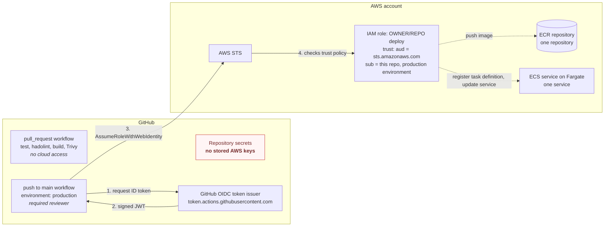

# GitHub Actions to AWS with OIDC and a least-privilege role

> **Personal lab / demonstration. Not client code.**

AWS access keys stored as CI secrets live for a long time and rarely get rotated. This lab deploys a small container
service to Amazon ECS on Fargate from GitHub Actions with **no stored AWS keys**. The deploy job gets a short-lived
OIDC token from GitHub and exchanges it for temporary credentials on an IAM role that trusts only this repository's
`main` branch and its `production` environment. That role can push to one ECR repository and update one ECS service,
nothing else. Pull requests build and test with no AWS access at all.

## What it demonstrates

- **GitHub OIDC federation to AWS.** An IAM OIDC identity provider for `token.actions.githubusercontent.com` and a role
  assumed with `sts:AssumeRoleWithWebIdentity`. Credentials last one hour at most and are never stored.
- **A trust policy scoped to one repository.** The audience must be `sts.amazonaws.com` and the subject must be
  exactly `repo:OWNER/REPO:environment:production` or `repo:OWNER/REPO:ref:refs/heads/main`. Forks, other branches,
  pull requests and other repositories are refused by STS.
- **A permission policy scoped to one ECR repository and one ECS service.** `iam:PassRole` is limited to the task
  execution role and only when passed to ECS tasks.
- **Pull requests with no cloud access.** The PR workflow runs with `permissions: contents: read`, so it cannot even
  request an OIDC token.
- **Supply-chain hygiene.** Every action is pinned to a commit SHA, the base image is pinned by digest, the container
  runs as a non-root user on a read-only root filesystem, and workflows pass `actionlint` and `zizmor`.

## Architecture



### Token flow, step by step

1. A push to `main` starts `deploy.yml`. The job declares `environment: production`, so it waits for the required
   reviewer before any step runs.
2. The job has `id-token: write`, so `aws-actions/configure-aws-credentials` can ask GitHub's OIDC issuer for a signed
   JWT. Its claims include `aud: sts.amazonaws.com` and `sub: repo:OWNER/REPO:environment:production`.
3. The action calls `sts:AssumeRoleWithWebIdentity` with that token and the role ARN from the `AWS_ROLE_ARN`
   repository variable. The ARN is not a secret.
4. STS validates the signature against the OIDC provider registered in the account, then evaluates the role's trust
   policy. Any other audience or subject is denied.
5. STS returns credentials that expire in one hour. The job logs in to ECR, pushes the image tagged with the commit
   SHA and run attempt, renders a new task definition revision and updates the service, then waits until the service
   is stable.

What the trust conditions block, and why, is in [docs/threat-notes.md](docs/threat-notes.md).

## Repository layout

```text
app/                  tiny HTTP service (Python standard library), Dockerfile, unit tests
infra/                Terraform: OIDC provider, deploy role, ECR repository, ECS cluster, service, task definition
infra/policies/       trust-policy.json.tftpl and deploy-policy.json.tftpl, readable on their own
.github/workflows/    ci.yml (pull request: test, hadolint, build, Trivy image scan)
                      deploy.yml (main: build, push, render task definition, deploy, wait for a stable service)
                      lint.yml (actionlint, zizmor, terraform fmt and validate, checkov)
docs/threat-notes.md  what the trust conditions block: forks, other branches, other repositories
```

## How to run it

Prerequisites: Terraform 1.6 or later, AWS credentials for a sandbox account with IAM admin rights (only for this
one-time setup), a VPC with subnets that can reach ECR, and a copy of this repository under your own account.

1. **Create the infrastructure once.**

   ```bash
   cd infra
   cp terraform.tfvars.example terraform.tfvars   # set github_owner, github_repo, vpc_id, subnet_ids
   terraform init
   terraform apply
   ```

   If the account already has the GitHub OIDC provider, set `create_oidc_provider = false`.

2. **Create the `production` environment** in the repository settings. Add a required reviewer and limit deployment
   branches to `main`.

3. **Add repository variables** (Settings, Secrets and variables, Actions, Variables). None of them is a secret:

   | Variable | Value |
   | --- | --- |
   | `AWS_ROLE_ARN` | `terraform output -raw deploy_role_arn` |
   | `AWS_REGION` | the region you used, for example `us-east-1` |
   | `ECR_REPOSITORY` | `terraform output -raw ecr_repository` |
   | `ECS_CLUSTER` | `terraform output -raw ecs_cluster` |
   | `ECS_SERVICE` | `terraform output -raw ecs_service` |
   | `ECS_TASK_FAMILY` | `terraform output -raw task_definition_family` |

4. **Push to `main`.** Approve the deployment, then watch the job assume the role, push the image and roll the service.
   The service starts with `desired_count = 0`; set it to `1` and apply again once the first image exists.

Run the checks locally:

```bash
uvx --with-requirements app/requirements-dev.txt pytest -q
docker build -t oidc-lab app
pre-commit run --all-files
```

## Checks you can repeat

- **A feature branch cannot assume the role.** Copy the credentials step into a workflow on a branch other than `main`
  with no environment and run it. The step fails with `Not authorized to perform sts:AssumeRoleWithWebIdentity`,
  because the token's subject is `repo:OWNER/REPO:ref:refs/heads/<branch>`.
- **A pull request cannot request a token at all.** `ci.yml` has no `id-token: write`, so any attempt to fetch a token
  fails before AWS is involved.
- **The federated session is visible in CloudTrail.** Look up `AssumeRoleWithWebIdentity` events in the region. The
  event shows `userIdentity.type: WebIdentityUser`, the identity provider `token.actions.githubusercontent.com`, the
  subject in `userIdentity.userName`, and the session name `gha-<run_id>-<attempt>`, which links it to one workflow run.

  ```bash
  aws cloudtrail lookup-events \
    --lookup-attributes AttributeKey=EventName,AttributeValue=AssumeRoleWithWebIdentity \
    --max-results 5
  ```

## Cost and teardown

The costs are the Fargate task while it runs, ECR storage for at most 10 images (a lifecycle rule expires the rest),
CloudWatch Logs and Container Insights, and one customer managed KMS key for the logs. Scale the service to zero
tasks between demos:

```bash
terraform apply -var desired_count=0
```

`terraform destroy` removes everything, including images in the repository (`ecr_force_delete` defaults to `true`).

## Variants

The same pattern (one OIDC provider, one role per deploy target, a subject pinned to a repository and environment)
works for other targets:

- **AWS Lambda:** replace the ECR and ECS statements with `lambda:UpdateFunctionCode` and
  `lambda:PublishVersion` on one function ARN.
- **S3 static hosting:** allow `s3:PutObject` and `s3:DeleteObject` on one bucket prefix and
  `cloudfront:CreateInvalidation` on one distribution.
- **GitLab CI:** register `https://gitlab.com` as the OIDC provider and match
  `project_path:GROUP/PROJECT:ref_type:branch:ref:main` in the subject condition.

## License

[MIT](LICENSE)
